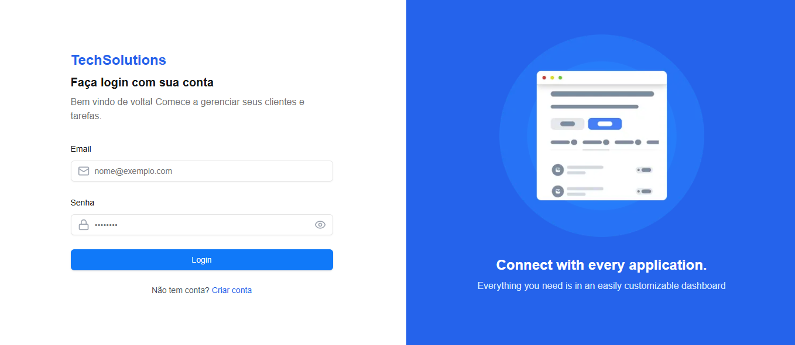

# Web-Based Task Management Application

This project is a web-based application designed to streamline task management for clients, programmers, and administrators. It leverages modern web technologies to ensure responsiveness, security, and usability. Below, you'll find an overview of the application, its features, and instructions for setting up and running the project.

## Overview

The application serves as a centralized platform for managing tasks and monitoring progress. It provides role-based dashboards for clients, programmers, and administrators, each with specific functionalities to enhance productivity and collaboration.

## Features

### Client Dashboard
- **Account Management**: Clients can register and log in securely using their email and password.
- **Task Creation**: Submit new tasks with details such as description, estimated hours, and priority.
- **Ongoing Tasks**: View a list of tasks currently being worked on.
- **Task History**: Access a record of all completed tasks and their status.
- **Hours Management**: Monitor contracted hours, remaining hours, and their status.

### Programmer Dashboard
- **Task View**: Programmers can see tasks assigned to them with all relevant details.
- **In-Progress Tasks**: Track tasks currently being worked on.
- **Completed Tasks**: Review tasks that have been successfully completed.

### Administrator Dashboard
- **User Management**: Access a list of all registered clients and programmers.
- **User Simulation**: "Log in" as a client or programmer to view their respective dashboards.
- **Task Delegation**: Manage all submitted tasks, assign them to programmers, or reject them as needed.

## Technical Details

- **Frontend**: Built using modern JavaScript frameworks such as React for a clean and responsive UI.
- **Backend**: Powered by Express.js to handle business logic and APIs.
- **Database**: Uses  MongoDB for persistent and reliable data storage.
- **Authentication**: Implements secure login functionality for role-based access.
- **Responsiveness**: Optimized for desktops, ensuring a seamless user experience.

This project aims to demonstrate practical task management solutions by integrating client, programmer, and admin functionalities in one platform. Future enhancements may include mobile responsiveness, advanced analytics, and integrations with third-party tools.
